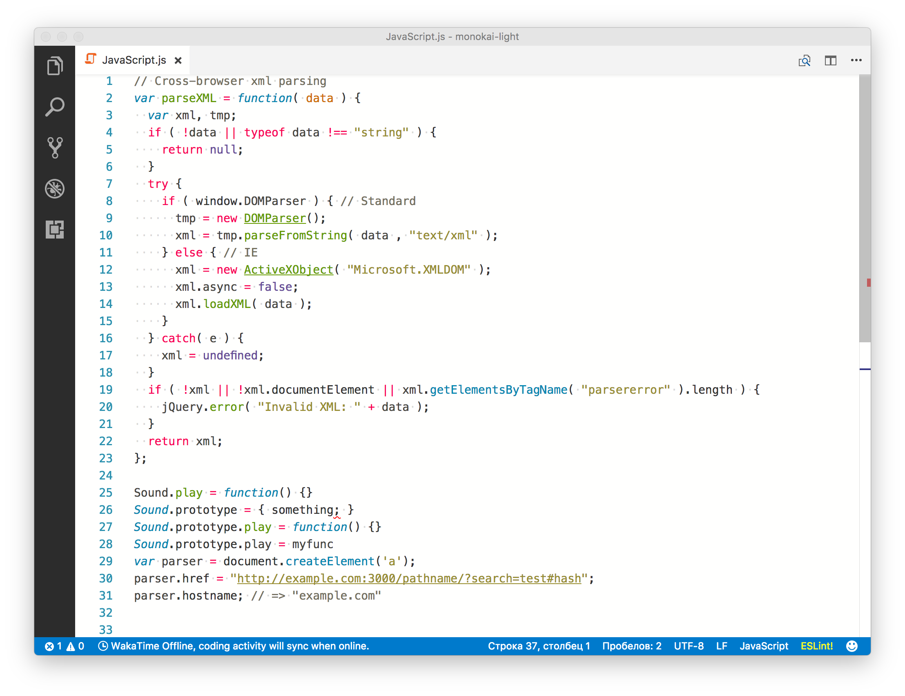
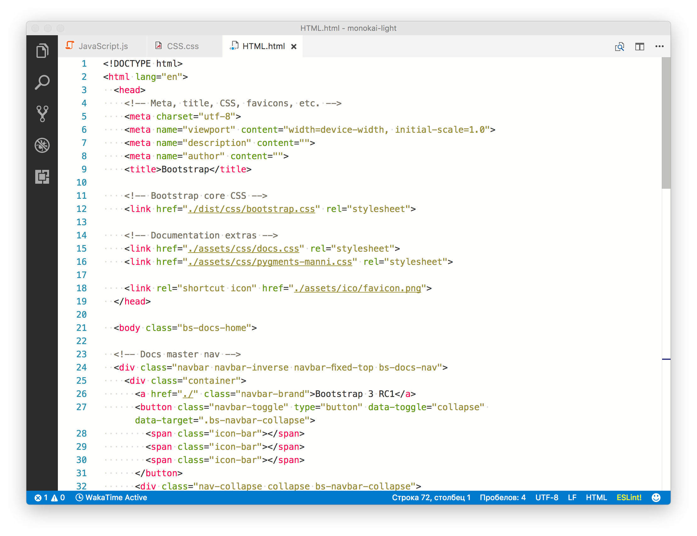
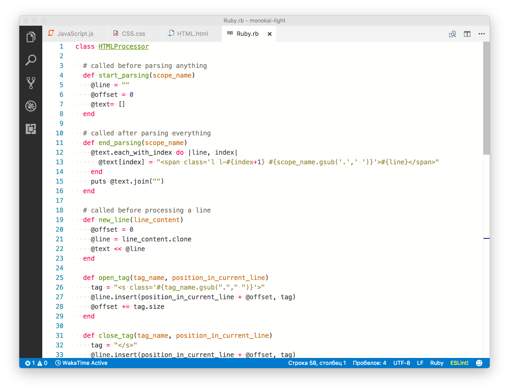

# Monokai Light Theme

VSCode Theme based on [Monokai Light](https://github.com/zoxon/monokai-light) theme

## Screenshots
### JavaScript

### CSS

### HTML

### HTML

## Installing

This extension is available for free in the [Visual Studio Code Marketplace](https://marketplace.visualstudio.com/)

## What's new?

Click here to go to the [Changelog](https://github.com/akamud/vscode-theme-onelight/blob/master/CHANGELOG.md)

## Source code
[Github](https://github.com/zoxon/vscode-theme-monokai-light)

## Licence
[MIT License](LICENSE.md)
